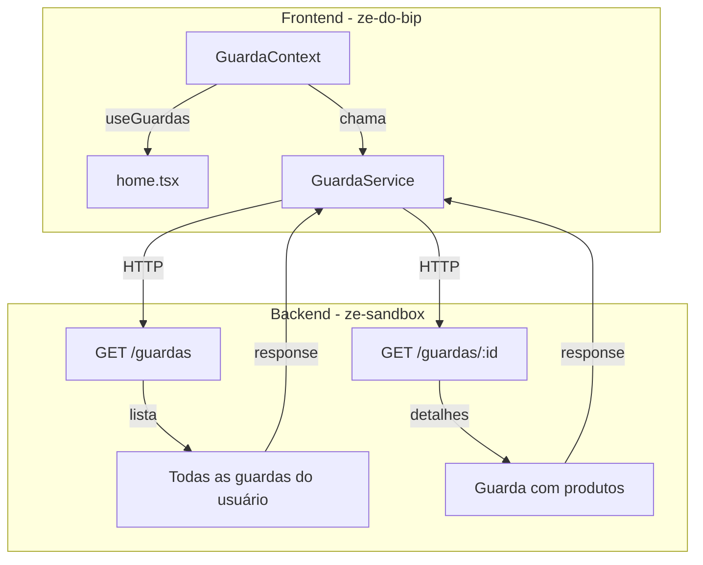

# Migração de Guardas para Context API

## Objetivo

Eliminar a dependência do `appStore.ts` (Zustand) para guardas, migrando para Context API seguindo o padrão do `AuthContext`. O frontend será apenas uma camada de apresentação, delegando toda lógica de negócio ao backend (ze-sandbox).

## Escopo Inicial (Esta Fase)

- **Foco**: `listarGuardas()` e `detalhesGuarda()` apenas
- **Objetivo**: Renderização das listas em `home.tsx`
- **Fora do escopo inicial**: Assumir guarda, finalizar guarda, marcar produto, modo offline

## Arquitetura Proposta

### Fluxo de Dados



## Plano de Implementação

### Fase 1: Refatorar GuardaService (Simplificar)

#### 1.1 Simplificar `services/GuardaService.ts`

- Remover toda lógica de sincronização complexa
- Remover dependência de `OfflineService` (por enquanto)
- Manter apenas chamadas HTTP diretas ao ze-sandbox
- Confiar na resposta da API como fonte da verdade

**Métodos a manter (simplificados)**:

```typescript
class GuardaService {
  // Listar todas as guardas do usuário (já separadas por status)
  async listarGuardas(cd_usuario: string): Promise<{
    disponiveis: Guarda[];
    emAndamento: Guarda[];
    finalizadas: Guarda[];
  }>;
  
  // Obter detalhes de uma guarda específica (com produtos)
  async obterDetalhesGuarda(sq_guarda: string): Promise<Guarda | null>;
  
  // Iniciar uma guarda (manter existente)
  async iniciarGuarda(sq_guarda: string): Promise<boolean>;
  
  // Finalizar uma guarda (manter existente)
  async finalizarGuarda(sq_guarda: string): Promise<boolean>;
  
  // Health check simples
  async verificarConectividade(): Promise<boolean>;
}
```

#### 1.2 Mapeamento de dados

- O sandbox agora retorna `no_fornecedor` corretamente
- Manter o mapeamento atual do conversor

### Fase 2: Criar GuardaContext

#### 2.1 Criar `contexts/GuardaContext.tsx`

**Interface do Context**:

```typescript
interface GuardaContextData {
  // Estado de leitura
  guardas: {
    disponiveis: Guarda[];
    emAndamento: Guarda[];
    finalizadas: Guarda[];
  };
  guardaAtual: Guarda | null;  // Guarda selecionada com detalhes
  
  // Estado de loading
  isLoading: boolean;
  isRefreshing: boolean;
  isLoadingDetalhes: boolean;
  
  // Ações de leitura
  carregarGuardas: () => Promise<void>;
  refreshGuardas: () => Promise<void>;
  selecionarGuarda: (guardaId: string) => Promise<Guarda | null>;
  
  // Estado de conexão
  isOnline: boolean;
}
```

**Implementação**:

- `carregarGuardas()`: Chama `GuardaService.listarGuardas()` com `cd_usuario` do `AuthContext`
- `refreshGuardas()`: Mesma lógica com flag `isRefreshing` para pull-to-refresh
- `selecionarGuarda()`: Chama `GuardaService.obterDetalhesGuarda()` e guarda em `guardaAtual`
- Auto-refresh quando `AuthContext.isLoggedIn` muda para true

#### 2.2 Atualizar `contexts/index.ts`

- Exportar `GuardaContext`, `GuardaProvider`, `useGuardas`

#### 2.3 Atualizar `app/_layout.tsx`

- Envolver app com `<GuardaProvider>` dentro do `<AuthProvider>`
- GuardaProvider precisa do AuthContext, então deve estar aninhado

### Fase 3: Migrar home.tsx

#### 3.1 Substituir useAppStore por useGuardas

**Antes**:

```typescript
const {
  guardasDisponiveis,
  guardasAssumidas,
  guardasFinalizadas,
  guardaAtiva,
  carregandoGuardas,
  carregarGuardas,
  refreshGuardas,
} = useAppStore();
```

**Depois**:

```typescript
const {
  guardas: { disponiveis, emAndamento, finalizadas },
  isLoading,
  isRefreshing,
  carregarGuardas,
  refreshGuardas,
} = useGuardas();
```

#### 3.2 Ajustar renderização

- `guardasDisponiveis` → `disponiveis`
- `guardasAssumidas` → `emAndamento`
- `guardasFinalizadas` → `finalizadas`
- `carregandoGuardas` → `isLoading`

#### 3.3 Manter compatibilidade temporária

- `assumirGuarda` ainda usa `useAppStore` (migrar depois)
- `guardaAtiva` pode ser derivado de `emAndamento[0] `ou usar `guardaAtual`

## Arquivos a Modificar

### Novos

- `contexts/GuardaContext.tsx`

### Modificar

- `services/GuardaService.ts` - simplificar drasticamente
- `contexts/index.ts` - adicionar exports
- `app/_layout.tsx` - adicionar GuardaProvider
- `app/home.tsx` - migrar para useGuardas

### Manter (por enquanto)

- `store/appStore.ts` - ainda usado por LeituraInterface.tsx e ações
- `components/LeituraInterface.tsx` - migrar em fase posterior

## Fases Futuras (Fora do Escopo Atual)

### Fase 4: Migrar Ações

- `assumirGuarda()` → POST /guardas/:id/iniciar
- `finalizarGuarda()` → POST /guardas/:id/finalizar
- `marcarProdutoConcluido()` → lógica local (ou API se backend suportar)

### Fase 5: Modo Offline

- Criar `GuardaRepository` (SQLite) similar ao `AuthRepository`
- Cache de guardas assumidas localmente
- Sync queue para ações offline

### Fase 6: Remover appStore

- Migrar `LeituraInterface.tsx` para `useGuardas`
- Deletar `store/appStore.ts`

## Testes de Validação

1. ✅ Guardas são carregadas ao fazer login
2. ✅ Lista separada corretamente (disponíveis/em andamento/finalizadas)
3. ✅ Pull-to-refresh funciona
4. ✅ Nome do fornecedor aparece corretamente
5. ✅ Detalhes da guarda são carregados ao clicar